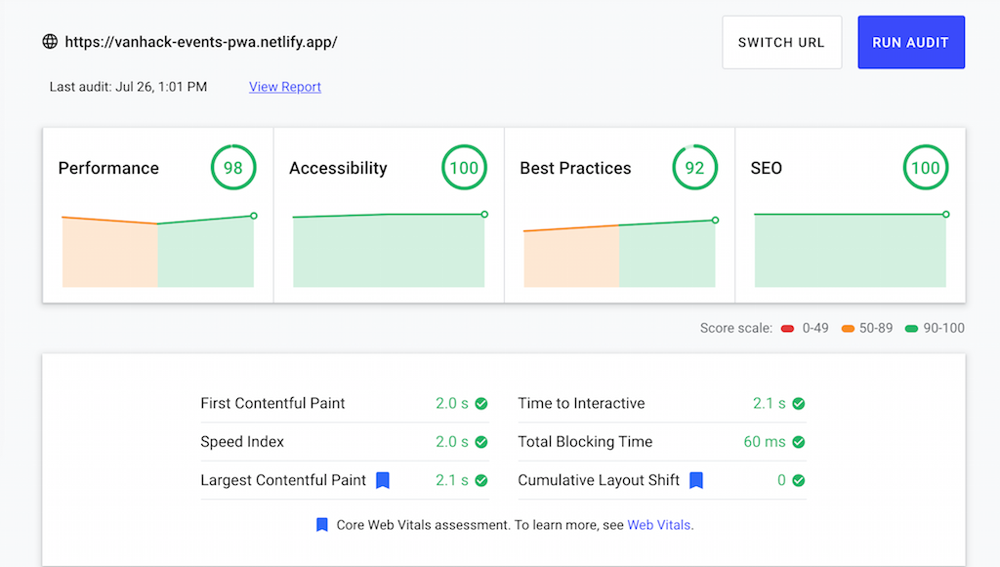

# VanHack Events PWA

 [https://vanhack-events-pwa.netlify.app](https://vanhack-events-pwa.netlify.app/)

 

I decided to build my VanHack assessment project on HackerRank further. The goal here is to attempt to build a better events experience for VanHackers, using modern web technologies while prioritising UX, performance and the [core web vitals metrics](https://web.dev/vitals/).

I haven't gotten to build the PWA parts just yet, but [performance is doing ok](https://lighthouse-dot-webdotdevsite.appspot.com//lh/html?url=https%3A%2F%2Fvanhack-events-pwa.netlify.app%2F) for now : 

## TODO (move these into GitHub issues)
*   Re-factor [app.js](./src/js/app.js) and break it down into smaller modules
*   Evolve into a PWA
*   Progressively enhance the PWA with modern capabilities like [Web Share](https://web.dev/web-share/)
*   Add an about link, pointing to an external resource (article or YT video), explaining how this was thought of, designed and built
